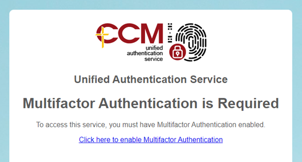
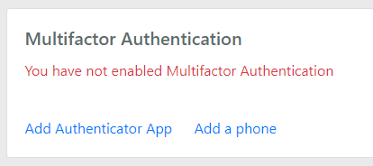
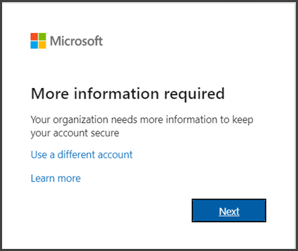

---
authors:
  - name: Cameron Weir
    email: 
    link: 
    avatar: ../static/CameronWeir_Icon.png
description: 
icon: 
layout: default
order: 0
visibility: public
---
# Multi-factor Authentication (MFA /2FA)
## What is multi-factor authentication?

Traditionally, users have logged into services using only a username and password combination. This is known as single-factor authentication. One of the problems with single-factor authentication is that a malicious user can easily access your account if they obtain your password. This could occur through a hacking attempt, data leak or [phishing attack](https://ovic.vic.gov.au/privacy/for-agencies/guidance-and-resources/what-are-phishing-attacks-and-how-to-protect-against-them/).

To make your account more secure, many services are now adding an additional authentication factor. This means your authentication consists of two factors: "Something you know" + "Something you have". The two most common forms of MFA are SMS verification codes and time-based authentication codes generated by an app. You have likely already used MFA if you conduct your banking online.

A breach of your account can have significant impacts including mass data leaks. This can have serious financial penalties. To protect both yourself and the organisation from liabilities should your account become compromised, we are progressively enabling multi-factor authentication across a range of our services.

[!embed](https://www.microsoft.com/en-us/videoplayer/embed/RE4CQKG?pid=ocpVideo0-innerdiv-oneplayer&postJsllMsg=true&maskLevel=20&market=en-us)

**Christian Community Ministries makes use of two different authentication services. These have separate multifactor authentication requirements and need to be configured individually.**

+++ CCM Unified Authentication Service

For services accessible by students, staff & parents including:
- Edumate
- Learner.Link

You will be prompted to set up your MFA when you first log in.

The following methods generating the authentication tokens are officially supported:
- SMS (mobile service required)
- Microsoft Authenticator mobile app (no service required)
- Token2 programmable card (suitable for staff who do not have a mobile device).

In addition, staff may choose to use any other password management app or browser extension capable of generating TOTP tokens such as Google Authenticator, 1Password or LastPass. Limited technical support is available for these options but general instructions are provided at the bottom of the page.

**Setting up SMS or Microsoft Authenticator app**

You will be automatically prompted to setup multifactor authentication the first time you login.

Once you select "Click here to enable Multifactor Authentication", you can select the authentication method you wish to use. We recommend that you set up both options. This can be done once you have configured the first option.

When you select "Add Authenticator App", you will be presented with a QR code to scan. **You will need to scan this code with a multifactor authentication app.** We recommend that you install the [Microsoft Authenticator](https://www.microsoft.com/en-us/account/authenticator) app as this can also be used for CCM Single Sign-On authentication.

###**Setting up Token2 programmable card**

This service will be coming soon. Please express interest to your local IT Manager.

####**Setting up a generic password management app or browser extension**

The following options are common alternatives. They are not officially supported by IT Services:
1. 1Password (commercial mobile app + browser extension)
2. LastPass (commercial mobile app + browser extension)
3. [Gauth Authenticator](https://chrome.google.com/webstore/detail/gauth-authenticator/ilgcnhelpchnceeipipijaljkblbcobl) (open source browser extension)
4. [WinAuth](https://winauth.github.io/winauth/index.html) (open source desktop app)

If your app is unable to scan the QR code, you can add a service manually. To do this you will need to extract the secret key from the QR code:
1. Right-click the displayed QR code and save it to your computer
2. Upload the QR code to [https://qrinfopoint.com/qr-code-scanner/](https://qrinfopoint.com/qr-code-scanner/)
3. The secret key will be shown on screen. It is a string of numbers and letters.
4. In your preferred app, add a new service, look for a one time password option and copy the secret key.

+++ CCM Single Sign-On

For services accessible by students & staff only including:
- Office 365 including Outlook, Teams, OneDrive etc
- Ci Anywhere
- Clickview

>CCM Single Sign-On accounts will be progressively enabled for multifactor authentication during 2021. 

1. Sign into Microsoft 365 with your work or school account with your password like you normally do. After you choose **Sign in**, you'll be prompted for more information.

2. Choose **Next**.

3. The default authentication method is to use the free Microsoft Authenticator app. If you have it installed on your mobile device, select **Next** and follow the prompts to add this account. If you don't have it installed there is a link provided to download it.

* If you would rather use SMS messages sent to your phone instead, select **I want to set up a different method**. Microsoft 365 will ask for your mobile number, then send you an SMS message containing a 6-digit code to verify your device.

4. Once you complete the instructions to specify your additional verification method, the next time you sign in to Microsoft 365, you'll be prompted to provide the additional verification information or action, such as typing the verification code provided by your authenticator app or sent to you by text message.
+++