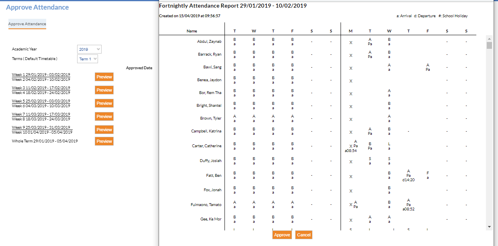

---
authors:
  - name: Sarah Dawson <small>Edumate Coordinator</small>
    email: 
    link: 
    avatar: ../static/SarahDawson_Icon.png
description: 
title: Approve Attendance
icon: 
layout: default
order: 0
visibility: public
---
# Attendance - "Approve Attendance" in Edumate

In order to satisfy the legislative requirements in the security and integrity of attendance data it is important that schools complete the 'Approve Attendance' process in Edumate, on a fortnightly basis.

Prior to 'Attendance Approval' is important that you have completed all steps to ensure that all unexplained absences have been followed up with carers, giving them the opportunity to provide an explanation or verification.  Follow should be done via:
- Daily SMS (at approximately 10:30am) each school day.
- Morning Notification (via school app, Edumate newsfeed) - optional.
- Afternoon Notification (via school app) allowing parents to write explanation straight into Edumate (school staff will be flagged with opportunity to check entries).
- Weekly 'Unexplained Absence' letter (can be turned on to automatically send) asking for explanation, for week prior.  Please note that there are two versions of this report.  One will display both partial and whole day absences.  While the second version will only display WHOLE day absences for parent explanation.

After 7 days of the absence being unexplained, despite mechanism in place seeking verification from carers, then absence becomes locked, via the 'Attendance Approval' process.

To complete the attendance approval process:
- Go to Attendance. 
- Attendance Approval. 
- Preview (the current fortnight) or fortnights not yet approved, and then 'approve'.  This will lock attendance in order to satisfy legislative requirements for both safety and integrity of data.

You will note that after approval, your login, date and time will be stored.  This is to provide an audit of this process.

Please note that codes used as NSW codes. Please see attached [Edumate's Attendance Reference Manual](https://ccmschools.sharepoint.com/:b:/r/sites/CorporateSystems/Shared%20Documents/Attendance-Reference-Manual_46528.pdf?csf=1&web=1&e=FRcCmX) which lists an explanation of codes, on page 3 below.

<iframe width="700" height="600" frameborder="0" src="https://ccmschools.sharepoint.com/:b:/r/sites/CorporateSystems/Shared%20Documents/Attendance-Reference-Manual_46528.pdf?csf=1&web=1&e=FRcCmX&amp;action=embedview&amp;wdAr=1.7777777777777777"></iframe>
