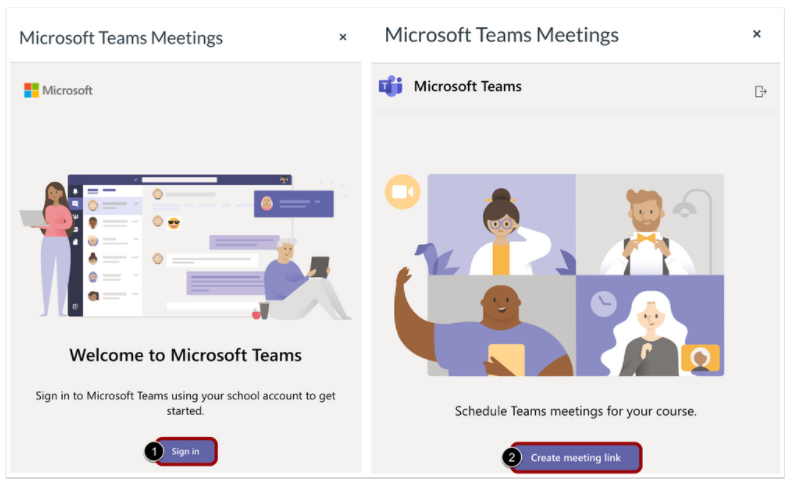
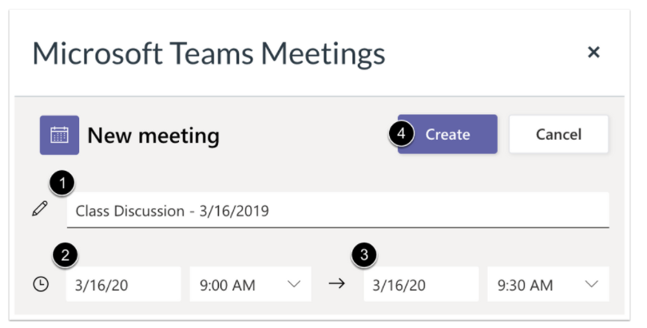

---
authors:
 - name: Cameron Weir
  email: 
  link: 
  avatar: ../static/CameronWeir_Icon.png
description: 
title: 
icon: 
layout: default
order: 0
visibility: public
---
# Engaging with students using Microsoft Teams

## Introduction

There are two ways in which you can engage with your students using the Microsoft Teams platform:
1. **Creating a Teams meeting only** - This option enables video conferencing between teachers and students.
2. **Creating a Class Team** - This option enables the full Teams experience with collaborative file sharing, channels & video conferencing. This option is also used to enable viewing of your classes devices in the Senso screen monitoring system.
A Team can also be rquested for a student special interest group or group of staff using the same request feorm as Option 2.

## Frequently Asked Questions

#### Why can't I create a Team directly myself?
In May 2019, CCM Principals ratified a [Corporate Communications Strategy policy](https://ccmschools.sharepoint.com/sites/ccm-policy/current/Forms/current-by-domain.aspx?id=/sites/ccm-policy/current/Corporate%20communications%20strategy.pdf&parent=/sites/ccm-policy/current) that governs the creation of Microsoft Teams. This policy requires that all Teams need to be manually requested and set up by IT Services to ensure appropriate naming and governance standards are applied. 

Unfortunately, there was an issue with the policy settings in the system that meant staff could still just create teams well into 2021. This setting has been fixed which is why creation is now appearing restricted. Without this setting in place, the number of Teams ballooned to over 6000 with random names and in some cases abandonment by teachers which left students to roam free. We have now whittled this back to about 1300.

#### How long will it take for my request to be actioned?
Student class teams are typically provisioned within 24 hrs. Staff teams may require additional time as suitability has to be determined.

+++ Option 1: Creating a Teams meeting only

This guide explains how to properly create a secure Microsoft Teams meeting session for engaging and video conferencing with your class online. If you have already created your meeting, please ensure you review the ['Securing your meeting​​​​​​​'](https://ccmschools.sharepoint.com/sites/CorporateSystems/SitePages/Creating-Teams-Class-Meetings-for-Online-Learning.aspx#securing-your-meeting) section at the bottom of this article to configure your meeting lobby access to prevent students from commencing the meeting without a teacher present.

It is recommended that you create a separate meeting link for each class group that shares your course. You can create your Teams meeting using from within the Teams client directly, from within Microsoft Outlook or from within Learner.Link. This guide will explain how to create the meeting from within Learner.Link which is the recommended method.

#### Creating your meeting link

##### Step 1 

Open the page in your Learner.Link course and begin editing the page content. Within the rich content editor, select the Integrations plugin icon and select Microsoft Teams Meeting.​​​​​​​

##### Step 2 
A dialogue box will launch. Sign in and then select 'Create meeting link.'

##### Step 3 
Enter the name of the meeting eg '9A History". If you plan on creating a separate link for each week, set the time and date as required. Alternatively, you can reuse the same link each lesson and ignore the time and date values that are prepopulated.

##### Step 4 
*From 26/01/2022 this option is enabled by default on all new meetings created.*

​​​​​​​A confirmation box will appear. By default, students can join the meeting when a teacher is not present. This is undesirable. To change this, select the 'Meeting options' link. Once the meeting options window loads, change "Who can bypass the lobby?" from People in my organisation to either 'Only you' or 'People I invite'. Save and close this window. Students will now be held in the meeting lobby until you admit them.

##### Step 5 
Press the Copy button. This will insert a meeting link into your page. You can edit the link text as required or even copy the link to reuse it on a graphic.

#### Securing your meeting

*From 26/01/2022 this option is enabled by default on all new meetings created.* 
By default, students can join the meeting when a teacher is not present. This is undesirable - instead, students should be held in the meeting lobby until you admit them. If you have already created your meeting using another means, such as via Outlook or the Teams client directly and did not configure the lobby settings you can edit them by:
1. Launching the meeting using the generated link.
2. Selecting **More actions \***\** at the top of the meeting window, and then **Meeting options**.
3. A panel or new window will open. Change "Who can bypass the lobby?" from People in my organisation, to either '**Only you**' or '**People I invite**

+++ Option 2: Creating a Class Team
To ensure consistency of naming and proper data management, teachers can request a class team be created by selecting the button below:

[!button variant="primary" corners="square" target="blank" icon="" iconAlign="left" text="Launch Learner.Link"](https://staff.ccmschools.app/)

+++